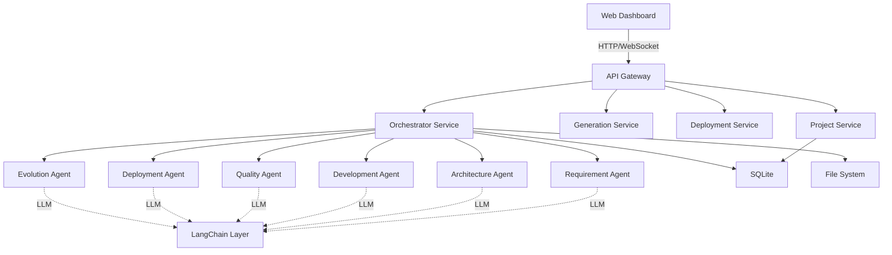

# 系统架构设计

## 1. 整体架构

### 1.1 分层架构

```
┌─────────────────────────────────────────────────────────────────────┐
│                        表现层 (Presentation Layer)                    │
│  ┌───────────────┐  ┌───────────────┐  ┌───────────────┐           │
│  │  Web Dashboard│  │  监控控制台     │  │  API Portal   │           │
│  │  (React)      │  │  (实时状态)    │  │  (外部集成)    │           │
│  └───────────────┘  └───────────────┘  └───────────────┘           │
└─────────────────────────────────────────────────────────────────────┘
                                    ↕
┌─────────────────────────────────────────────────────────────────────┐
│                        API网关层 (API Gateway)                       │
│  路由分发、认证授权、限流、日志                                        │
└─────────────────────────────────────────────────────────────────────┘
                                    ↕
┌─────────────────────────────────────────────────────────────────────┐
│                        业务服务层 (Business Service Layer)           │
│  ┌───────────────┐  ┌───────────────┐  ┌───────────────┐           │
│  │ 项目管理服务    │  │ 代码生成服务  │  │ 验证部署服务  │           │
│  │ (Project)     │  │ (Generation)  │  │ (Deployment)  │           │
│  └───────────────┘  └───────────────┘  └───────────────┘           │
│  ┌───────────────┐  ┌───────────────┐  ┌───────────────┐           │
│  │ Agent编排服务  │  │ 知识库服务    │  │ 监控告警服务  │           │
│  │ (Orchestrator) │  │ (Knowledge)   │  │ (Monitoring)  │           │
│  └───────────────┘  └───────────────┘  └───────────────┘           │
└─────────────────────────────────────────────────────────────────────┘
                                    ↕
┌─────────────────────────────────────────────────────────────────────┐
│                        Agent执行层 (Agent Execution Layer)          │
│  ┌───────────────┐  ┌───────────────┐  ┌───────────────┐           │
│  │ Requirement   │  │ Architecture  │  │ Development   │           │
│  │ Agent         │  │ Agent         │  │ Agent         │           │
│  └───────────────┘  └───────────────┘  └───────────────┘           │
│  ┌───────────────┐  ┌───────────────┐  ┌───────────────┐           │
│  │ Quality       │  │ Deployment    │  │ Evolution     │           │
│  │ Agent         │  │ Agent         │  │ Agent         │           │
│  └───────────────┘  └───────────────┘  └───────────────┘           │
└─────────────────────────────────────────────────────────────────────┘
                                    ↕
┌─────────────────────────────────────────────────────────────────────┐
│                        LangChain抽象层 (LangChain Layer)           │
│  LLM调用、Prompt管理、Chain编排、Memory管理                          │
└─────────────────────────────────────────────────────────────────────┘
                                    ↕
┌─────────────────────────────────────────────────────────────────────┐
│                        数据存储层 (Data Storage Layer)              │
│  ┌───────────────┐  ┌───────────────┐                           │
│  │  SQLite       │  │  File System  │                           │
│  │  (结构化数据)  │  │  (代码仓库)   │                           │
│  └───────────────┘  └───────────────┘                           │
└─────────────────────────────────────────────────────────────────────┘
                                    ↕
┌─────────────────────────────────────────────────────────────────────┐
│                        基础设施层 (infra Layer)              │
│  容器化、日志、监控、消息队列                                          │
└─────────────────────────────────────────────────────────────────────┘
```

### 1.2 核心组件关系



## 2. 模块划分

### 2.1 前端模块

| 模块 | 职责 | 技术栈 |
|------|------|--------|
| Dashboard | 主控制面板，展示系统状态 | React + Recharts |
| IdeaList | 项目想法管理（生成/添加/开发） | React + Framer Motion |
| ProjectList | 项目列表管理 | React + TanStack Query |
| ProjectDetail | 项目详情，实时进度 | React + WebSocket |
| CodeEditor | 代码预览与编辑 | Monaco Editor |
| LogsViewer | 实时日志查看 | React + xterm.js |
| KnowledgeBase | 知识库管理 | React + React Flow |
| Settings | 系统配置 | React + React Hook Form |
| Monitoring | 监控大屏 | React + Recharts/D3 |

### 2.2 后端模块

| 模块 | 职责 | 技术栈 |
|------|------|--------|
| API Server | HTTP API服务 | Express/Fastify |
| IdeaGeneratorAgent | 基于主题自动生成Idea | LangChain.js + LLM |
| Agent Orchestrator | Agent调度与编排 | 自定义框架 |
| LangChain Service | LLM交互抽象层 | LangChain.js |
| Project Manager | 项目生命周期管理 | 自定义 |
| Code Generator | 代码生成引擎 | 模板+LLM |
| Quality Validator | 质量验证引擎 | 静态分析+测试 |
| Deployment Engine | 自动部署引擎 | Docker/K8s |
| Knowledge Engine | 知识库管理 | SQLite |
| Monitoring Service | 监控与告警 | Prometheus+AlertManager |
| Event Bus | 事件驱动通信 | Redis/内存 |

### 2.3 Idea 管理模块

```
┌─────────────────────────────────────────────────────────────────────┐
│                      Idea 管理流程                                    │
└─────────────────────────────────────────────────────────────────────┘

用户输入主题 ──→ IdeaGeneratorAgent ──→ Planner ──→ Executor ──→ Critic
                        │                               │
                        ↓                               ↓
                   保存到数据库                    评估筛选
                        │                               │
                        ↓                               ↓
                   Idea 列表 ◀─────────────────────── Approved Ideas
                        │
            ┌───────────┼───────────┐
            ↓           ↓           ↓
        手动添加    主题生成     查看详情
            │           │           │
            └───────────┴─────┬─────┘
                              ↓
                        Start Development
                              │
                              ↓
                    Orchestrator 触发项目开发
```

### 2.4 数据模块

| 存储 | 用途 | 数据类型 |
|------|------|---------|
| SQLite | 项目元数据、配置、状态、知识库 | 结构化关系数据 |
| File System | 生成的代码、文档、构建产物 | 文件 |
| Redis | 缓存、会话、队列 | 键值对 |

## 3. 关键设计决策

### 3.1 为什么选择SQLite？

| 优势 | 说明 |
|------|------|
| 零配置 | 无需独立的数据库服务，降低部署复杂度 |
| 事务支持 | 完整的ACID保证，数据一致性可靠 |
| 文件存储 | 便于备份和迁移 |
| 性能充足 | 对于本项目规模（数百个项目/月）完全够用 |
| TypeScript支持 | better-sqlite3提供完整的类型支持 |

### 3.2 为什么选择LangChain.js？

| 优势 | 说明 |
|------|------|
| 统一抽象层 | 支持多种LLM提供商切换 |
| Chain编排 | 灵活的流程编排能力 |
| Memory管理 | 对话历史和上下文管理 |
| Tools生态 | 丰富的工具集成 |
| TypeScript支持 | 原生TypeScript支持 |

## 4. Agent交互模式

### 4.1 管道模式 (Pipeline)

适用于明确的线性流程：

```
需求 → 架构 → 开发 → 验证 → 部署
```

### 4.2 循环模式 (Loop)

适用于需要迭代的流程：

```
代码生成 ──→ 质量检查 ──→ [失败] ──→ 重新生成
                         ↓ [通过]
                    进入下一阶段
```

### 4.3 协作模式 (Collaboration)

适用于需要多个Agent协作的场景：

```
              ┌─────────────┐
              │ Architecture │
              │   Agent     │
              └──────┬──────┘
                     ↓
              ┌──────┴──────┐
              │    Meta     │
              │   Agent     │
              └──────┬──────┘
       ┌─────────────┼─────────────┐
       ↓             ↓             ↓
┌──────────┐  ┌──────────┐  ┌──────────┐
│ Frontend │  │ Backend  │  │ Database │
│  Agent   │  │  Agent   │  │  Agent   │
└──────────┘  └──────────┘  └──────────┘
```

## 5. 事件驱动架构

### 5.1 事件定义

| 事件 | 触发时机 | 消费者 |
|------|---------|--------|
| ProjectCreated | 项目创建 | Orchestrator, Monitoring |
| GenerationStarted | 生成开始 | Monitoring, Logs |
| PhaseCompleted | 阶段完成 | Orchestrator, Monitoring |
| GenerationFailed | 生成失败 | Orchestrator, Alerting |
| QualityCheckPassed | 质量检查通过 | Deployment |
| QualityCheckFailed | 质量检查失败 | Orchestrator |
| ProjectDeployed | 项目部署 | Monitoring, Evolution |
| ProjectFeedbackReceived | 收到反馈 | Evolution |

### 5.2 事件总线实现

```typescript
interface EventBus {
  publish(event: Event): Promise<void>;
  subscribe(eventType: string, handler: EventHandler): Unsubscribe;
}

interface Event {
  type: string;
  payload: unknown;
  timestamp: Date;
  correlationId: string;
}
```

## 6. 扩展性设计

### 6.1 插件化Agent

```typescript
interface AgentPlugin {
  name: string;
  version: string;
  capabilities: string[];
  initialize(context: AgentContext): Promise<void>;
  execute(task: Task): Promise<Result>;
  cleanup(): Promise<void>;
}
```

### 6.2 多LLM支持

```typescript
interface LLMProvider {
  name: string;
  completions(prompt: string, options?: CompletionOptions): Promise<string>;
  chat(messages: Message[], options?: ChatOptions): Promise<Message>;
  embeddings(text: string): Promise<number[]>;
}
```

### 6.3 多项目模板

```
templates/
├── crud-app/
│   ├── schema.yaml
│   ├── frontend/
│   └── backend/
├── data-tool/
│   ├── schema.yaml
│   └── scripts/
└── micro-saas/
    ├── schema.yaml
    ├── frontend/
    └── backend/
```

## 7. 性能考虑

### 7.1 并发控制

- 同时进行的生成任务限制：5个
- 单个任务LLM调用并发限制：10个
- 资源池管理：Worker模式

### 7.2 缓存策略

| 数据类型 | 缓存位置 | TTL |
|---------|---------|-----|
| LLM响应 | Redis | 24h |
| 全文检索结果 | Redis | 1h |
| 项目模板 | 内存 | 会话期 |
| 知识库条目 | SQLite内部 | 永久 |

### 7.3 队列机制

```typescript
interface TaskQueue {
  enqueue(task: Task): Promise<string>;
  dequeue(): Promise<Task>;
  getQueueLength(): number;
  cancel(taskId: string): Promise<void>;
}
```

## 8. 安全设计

### 8.1 认证授权

- API Token认证
- 基于角色的访问控制（RBAC）
- 敏感操作二次确认

### 8.2 代码安全

- 生成代码安全扫描（Snyk/ESLint-security）
- 依赖漏洞检查
- 沙箱环境测试

### 8.3 数据安全

- 敏感数据加密存储
- 审计日志
- 定期备份

---

**版本**: 0.2.0
**更新日期**: 2026-04-15
**状态**: 设计阶段
**变更**: 新增 Idea 管理模块，支持主题自动生成、手动添加、手动触发开发
