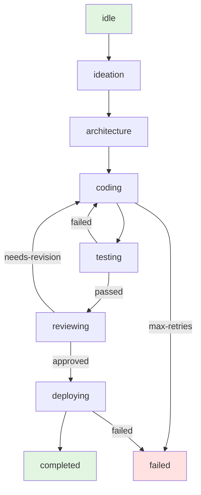

# 无限自动化项目生成系统 - 设计演进 v2

## 1. v1 到 v2 的演进

### 1.1 v1 的局限性

v1 版本是一个单Agent顺序执行的简化模型，存在以下局限：

**问题一：串行执行效率低**
- 所有任务串行执行，无法并行
- 长时间阻塞系统

**问题二：Agent能力单一**
- 每个Agent只能做一件事
- 缺乏协作能力
- 无法处理复杂依赖

**问题三：状态管理简单**
- 没有正式的状态机
- 错误恢复困难
- 流程控制受限

**问题四：缺少元认知**
- 系统不理解自己的能力边界
- 无法自我评估和改进
- 无法预测任务难度

### 1.2 v2 的改进目标

1. **并行执行** - 多Agent并行工作
2. **协作机制** - Agent之间可以协作
3. **状态管理** - 使用LangGraph正式化状态
4. **元认知基础** - 增加自我感知能力
5. **可扩展性** - 易于添加新Agent

## 2. 多Agent架构设计

### 2.1 Agent分层

```
┌─────────────────────────────────────────────────────────────────┐
│                    Meta-Agent Layer (元控制层)                    │
│  OrchestratorAgent - 协调所有Agent，管理整个工作流                 │
└─────────────────────────────────────────────────────────────────┘
                              ↓
┌─────────────────────────────────────────────────────────────────┐
│                  Strategy Agent Layer (策略层)                   │
│  ┌─────────────┐  ┌─────────────┐  ┌─────────────┐             │
│  │ Planner     │  │ Critic      │  │ Optimizer   │             │
│  │ Agent       │  │ Agent       │  │ Agent       │             │
│  └─────────────┘  └─────────────┘  └─────────────┘             │
└─────────────────────────────────────────────────────────────────┘
                              ↓
┌─────────────────────────────────────────────────────────────────┐
│                  Execution Agent Layer (执行层)                │
│  ┌─────────────┐  ┌─────────────┐  ┌─────────────┐             │
│  │ Idea        │  │ Architect   │  │ Coder       │             │
│  │ Generator   │  │ Agent       │  │ Agent       │             │
│  └─────────────┘  └─────────────┘  └─────────────┘             │
│  ┌─────────────┐  ┌─────────────┐  ┌─────────────┐             │
│  │ Tester      │  │ Reviewer    │  │ Deployer    │             │
│  │ Agent       │  │ Agent       │  │ Agent       │             │
│  └─────────────┘  └─────────────┘  └─────────────┘             │
└─────────────────────────────────────────────────────────────────┘
                              ↓
┌─────────────────────────────────────────────────────────────────┐
│                 Meta-Cognition Layer (元认知层)                 │
│  ┌─────────────┐  ┌─────────────┐  ┌─────────────┐             │
│  │ Observer    │  │ Reflector   │  │ Improver    │             │
│  │ Agent       │  │ Agent       │  │ Agent       │             │
│  └─────────────┘  └─────────────┘  └─────────────┘             │
└─────────────────────────────────────────────────────────────────┘
```

### 2.2 Agent协作模式

#### 模式一：管道模式

适用于线性流程，Agent依次处理数据：

```
IdeaGenerator → ArchitectAgent → CoderAgent → TesterAgent → DeployerAgent
```

#### 模式二：并行模式

适用于独立任务，多个Agent同时工作：

```
                 ┌─→ FrontendCoderAgent ──┐
ArchitectAgent ──┤                         ├──→ MergeAgent
                 └─→ BackendCoderAgent  ──┘
```

#### 模式三：反馈模式

适用于需要迭代的场景：

```
CoderAgent → TesterAgent → [Failed] → CoderAgent (retry)
                           ↓ [Passed]
                      DeployerAgent
```

#### 模式四：协作模式

多个Agent共同完成一个任务：

```
         ┌─────────────┐
         │  Project    │
         │   Context   │
         └──────┬──────┘
                │
       ┌────────┼────────┐
       ↓        ↓        ↓
  ┌────────┐ ┌────────┐ ┌────────┐
  │  Idea  │ │Arch    │ │Review  │
  │  Gen   │ │ Agent  │ │ Agent  │
  └────────┘ └────────┘ └────────┘
       │        │        │
       └────────┼────────┘
                ↓
         ┌─────────────┐
         │ Orchestrator│
         │    Agent    │
         └─────────────┘
```

### 2.3 Agent接口定义

```typescript
// 所有Agent的基础接口
interface BaseAgent<I, O> {
  name: string;
  description: string;

  // 执行任务
  execute(input: I, context: AgentContext): Promise<AgentResult<O>>;

  // 能力声明
  canHandle(task: Task): boolean;

  // 资源需求
  getResources(): ResourceRequirements;
}

// Agent执行上下文
interface AgentContext {
  projectId: string;
  sessionId: string;
  sharedMemory: Map<string, any>;
  agentHistory: AgentExecution[];
}

// Agent执行结果
interface AgentResult<O> {
  success: boolean;
  output: O;
  artifacts: Artifact[];
  metrics: ExecutionMetrics;
  errors?: Error[];
}

// 执行指标
interface ExecutionMetrics {
  duration: number;
  tokensUsed: number;
  cost: number;
  timestamp: Date;
}
```

## 3. LangGraph状态机设计

### 3.1 状态定义

```typescript
// 项目开发状态
interface ProjectState {
  // 项目基础信息
  projectId: string;
  idea?: ProjectIdea;
  architecture?: Architecture;
  code?: Codebase;
  tests?: TestSuite;
  review?: CodeReview;
  deployment?: Deployment;

  // 流程状态
  currentStage: Stage;
  stageHistory: Stage[];

  // 元数据
  metadata: {
    startTime: Date;
    currentPhase: Phase;
    iterationCount: number;
    qualityScore: number;
  };

  // 错误处理
  errors: ErrorRecord[];
  retryCount: Map<string, number>;
}

type Stage =
  | 'idle'
  | 'ideation'
  | 'architecture'
  | 'coding'
  | 'testing'
  | 'reviewing'
  | 'deploying'
  | 'completed'
  | 'failed';
```

### 3.2 状态图



### 3.3 节点定义

```typescript
// LangGraph节点定义
const nodes: Record<string, Node> = {
  // 需求生成节点
  ideation: {
    agent: IdeaGeneratorAgent,
    input: (state: ProjectState) => ({ state }),
    output: (result: any, state: ProjectState) => ({
      ...state,
      idea: result.idea,
      currentStage: 'ideation'
    })
  },

  // 架构设计节点
  architecture: {
    agent: ArchitectAgent,
    input: (state: ProjectState) => ({ idea: state.idea }),
    output: (result: any, state: ProjectState) => ({
      ...state,
      architecture: result.architecture,
      currentStage: 'architecture'
    })
  },

  // 代码生成节点
  coding: {
    agent: CoderAgent,
    input: (state: ProjectState) => ({
      architecture: state.architecture,
      review: state.review
    }),
    output: (result: any, state: ProjectState) => ({
      ...state,
      code: result.code,
      currentStage: 'coding'
    })
  },

  // ...更多节点
};
```

### 3.4 边条件

```typescript
// 边条件定义
const edges: Edge[] = [
  // 线性边
  { from: 'idle', to: 'ideation' },
  { from: 'ideation', to: 'architecture' },
  { from: 'architecture', to: 'coding' },

  // 条件边
  {
    from: 'testing',
    to: 'reviewing',
    condition: (state) => state.tests?.passed === true
  },
  {
    from: 'testing',
    to: 'coding',
    condition: (state) => state.tests?.passed === false
  },

  // 复杂条件
  {
    from: 'coding',
    to: 'failed',
    condition: (state) => {
      const retryCount = state.retryCount.get('coding') || 0;
      return retryCount >= MAX_RETRIES;
    }
  }
];
```

## 4. 元认知基础设计

### 4.1 自我感知

系统能够感知自己的状态和能力边界：

```typescript
interface SelfAwareness {
  // 能力感知
  capabilities: {
    canGenerate: ProjectType[];
    supportedTechStacks: string[];
    maxComplexity: 'simple' | 'medium' | 'complex';
  };

  // 资源感知
  resources: {
    apiQuota: { used: number; total: number };
    queueLength: number;
    activeProjects: number;
  };

  // 性能感知
  performance: {
    avgGenerationTime: number;
    successRate: number;
    avgQualityScore: number;
  };
}

// 能力查询
function canHandleProject(projectType: string, complexity: string): boolean {
  const awareness = getSelfAwareness();
  return awareness.capabilities.canGenerate.includes(projectType as ProjectType) &&
         isComplexitySupported(complexity, awareness.capabilities.maxComplexity);
}
```

### 4.2 上下文理解

系统能够理解当前所处的上下文：

```typescript
interface SystemContext {
  temporal: {
    currentTime: Date;
    uptime: number;
    currentPhase: 'startup' | 'normal' | 'maintenance';
  };

  load: {
    current: number; // 0-1
    predicted: number; // 0-1
    trend: 'increasing' | 'stable' | 'decreasing';
  };

  knowledge: {
    totalPatterns: number;
    recentLearnings: Knowledge[];
    staleCount: number;
  };
}

// 上下文感知决策
function decideNextAction(context: SystemContext): string {
  if (context.load.current > 0.8) {
    return 'defer_new_projects';
  }
  if (context.knowledge.staleCount > 100) {
    return 'clean_knowledge_base';
  }
  return 'process_next_project';
}
```

### 4.3 简单自我评估

系统能够评估自己的表现：

```typescript
interface SelfAssessment {
  generation: {
    successRate: number;
    avgQuality: number;
    avgTime: number;
  };

  knowledge: {
    coverage: number;
    freshness: number;
    utilization: number;
  };

  overall: number;
}

function assessSelf(): SelfAssessment {
  const stats = getSystemStats();

  return {
    generation: {
      successRate: stats.projects.completed / stats.projects.total,
      avgQuality: stats.projects.avgQuality,
      avgTime: stats.projects.avgTime
    },
    knowledge: {
      coverage: stats.knowledge.usedPatterns / stats.knowledge.totalPatterns,
      freshness: stats.knowledge.avgFreshness,
      utilization: stats.knowledge.avgUsage
    },
    overall: calculateOverall(stats)
  };
}
```

## 5. 改进的数据模型

### 5.1 Agent执行记录

```sql
CREATE TABLE agent_executions (
  id TEXT PRIMARY KEY,
  agent_name TEXT NOT NULL,
  project_id TEXT NOT NULL,
  stage TEXT NOT NULL,
  input JSON,
  output JSON,
  success BOOLEAN NOT NULL,
  duration_ms INTEGER,
  tokens_used INTEGER,
  cost REAL,
  errors JSON,
  timestamp INTEGER NOT NULL,
  INDEX idx_agent_executions_agent (agent_name),
  INDEX idx_agent_executions_project (project_id),
  INDEX idx_agent_executions_stage (stage)
);
```

### 5.2 状态机状态

```sql
CREATE TABLE state_machine_states (
  id TEXT PRIMARY KEY,
  project_id TEXT NOT NULL UNIQUE,
  current_stage TEXT NOT NULL,
  stage_history JSON NOT NULL,
  state_data JSON NOT NULL,
  errors JSON,
  retry_counts JSON NOT NULL,
  updated_at INTEGER NOT NULL,
  INDEX idx_state_machine_states_stage (current_stage)
);
```

### 5.3 元认知数据

```sql
CREATE TABLE meta_cognition (
  id TEXT PRIMARY KEY,
  timestamp INTEGER NOT NULL,
  type TEXT NOT NULL, -- 'self_awareness', 'context', 'assessment'
  content JSON NOT NULL,
  INDEX idx_meta_cognition_timestamp (timestamp),
  INDEX idx_meta_cognition_type (type)
);
```

## 6. 改进的工作流

### 6.1 并行代码生成

```
架构设计完成
       ↓
  ┌────────┴────────┐
  ↓                 ↓
Frontend Code   Backend Code
Generator        Generator
       ↓                 ↓
  └────────┬────────┘
       ↓
    代码合并
       ↓
    测试阶段
```

### 6.2 带反馈的迭代

```
代码生成
       ↓
    测试
       ↓
  [通过] ──→ 审查 ──→ [通过] ──→ 部署
       ↓         ↓
    [失败]    [需修改]
       ↓         ↓
  问题分析  修改建议
       └─────┬─────┘
             ↓
       重新生成
             ↓
      [最多重试3次]
```

### 6.3 质量门控

```
每阶段完成后检查：
├─ 质量分数 >= 阈值？
│  └─ 是 → 进入下一阶段
│  └─ 否 → 重试或回退
├─ 成功率在可接受范围？
│  └─ 是 → 继续
│  └─ 否 → 暂停并告警
└─ 资源消耗是否合理？
   └─ 是 → 继续
   └─ 否 → 降级策略
```

## 7. 改进的Agent实现

### 7.1 IdeaGeneratorAgent

```typescript
class IdeaGeneratorAgent extends BaseAgent<{}, ProjectIdea> {
  name = 'IdeaGenerator';

  async execute(input: {}, context: AgentContext): Promise<AgentResult<ProjectIdea>> {
    // 1. 获取上下文知识
    const patterns = await this.retrieveKnowledge('idea_patterns');
    const history = await this.getRecentHistory(10);

    // 2. 使用LangChain生成创意
    const chain = this.buildIdeaChain(patterns, history);
    const result = await chain.invoke({ context });

    // 3. 评估创意价值
    const valueScore = await this.evaluateValue(result.idea);

    // 4. 只保留高价值创意
    if (valueScore < MIN_VALUE_THRESHOLD) {
      return {
        success: false,
        output: null as any,
        artifacts: [],
        metrics: { duration: 0, tokensUsed: 0, cost: 0, timestamp: new Date() },
        errors: [new Error('Idea value too low')]
      };
    }

    // 5. 存储创意
    await this.saveIdea(result.idea);

    return {
      success: true,
      output: result.idea,
      artifacts: [{ type: 'idea', content: result.idea }],
      metrics: { duration, tokensUsed, cost, timestamp: new Date() }
    };
  }

  private async evaluateValue(idea: ProjectIdea): Promise<number> {
    // 实现价值评估逻辑
    // - 新颖性
    // - 实用性
    // - 可行性
    // - 独特性
    return 0.8; // 示例
  }
}
```

### 7.2 ArchitectAgent

```typescript
class ArchitectAgent extends BaseAgent<ProjectIdea, Architecture> {
  name = 'Architect';

  async execute(input: { idea: ProjectIdea }, context: AgentContext): Promise<AgentResult<Architecture>> {
    const { idea } = input;

    // 1. 检索相关架构模式
    const patterns = await this.retrieveArchitecturePatterns(idea.type);

    // 2. 生成架构设计
    const chain = this.buildArchitectureChain(patterns);
    const architecture = await chain.invoke({ idea, patterns });

    // 3. 验证架构完整性
    const validation = await this.validateArchitecture(architecture);

    if (!validation.valid) {
      return {
        success: false,
        output: null as any,
        artifacts: [],
        metrics: { duration: 0, tokensUsed: 0, cost: 0, timestamp: new Date() },
        errors: validation.errors
      };
    }

    // 4. 存储架构
    await this.saveArchitecture(architecture);

    return {
      success: true,
      output: architecture,
      artifacts: [{ type: 'architecture', content: architecture }],
      metrics: { duration, tokensUsed, cost, timestamp: new Date() }
    };
  }
}
```

### 7.3 CoderAgent

```typescript
class CoderAgent extends BaseAgent<Architecture, Codebase> {
  name = 'Coder';

  async execute(input: { architecture: Architecture }, context: AgentContext): Promise<AgentResult<Codebase>> {
    const { architecture } = input;

    // 1. 根据架构生成代码
    const files: File[] = [];

    // 并行生成各个文件
    const generationTasks = architecture.files.map(async (fileSpec) => {
      const fileCode = await this.generateFile(fileSpec, architecture);
      return {
        path: fileSpec.path,
        content: fileCode,
        language: this.detectLanguage(fileSpec.path)
      };
    });

    files.push(...await Promise.all(generationTasks));

    // 2. 生成配置文件
    const configs = await this.generateConfigurations(architecture);

    // 3. 验证代码
    const validation = await this.validateCode(files);

    if (!validation.valid) {
      return {
        success: false,
        output: null as any,
        artifacts: [],
        metrics: { duration: 0, tokensUsed: 0, cost: 0, timestamp: new Date() },
        errors: validation.errors
      };
    }

    // 4. 返回代码库
    const codebase: Codebase = { files, configs };

    return {
      success: true,
      output: codebase,
      artifacts: [{ type: 'codebase', content: codebase }],
      metrics: { duration, tokensUsed, cost, timestamp: new Date() }
    };
  }

  private async validateCode(files: File[]): Promise<{ valid: boolean; errors: Error[] }> {
    // 实现代码验证
    // - 语法检查
    // - 格式检查
    // - 安全扫描
    return { valid: true, errors: [] };
  }
}
```

## 8. 改进的API设计

### 8.1 项目API

```typescript
// 创建并启动项目
POST /api/projects
Request: { type: string; complexity: string; preferences: any }
Response: { projectId: string; initialStatus: string }

// 获取项目状态
GET /api/projects/:id
Response: { status: string; stage: string; progress: number; ... }

// 获取项目详情
GET /api/projects/:id/details
Response: { idea, architecture, code, tests, ... }

// 暂停项目
POST /api/projects/:id/pause
Response: { success: boolean }

// 恢复项目
POST /api/projects/:id/resume
Response: { success: boolean }
```

### 8.2 Agent API

```typescript
// 获取Agent状态
GET /api/agents/:name
Response: { name, status, activeProjects, metrics }

// 获取Agent历史
GET /api/agents/:name/history
Response: { executions: [...] }

// 获取Agent性能
GET /api/agents/:name/performance
Response: { successRate, avgDuration, avgCost, ... }
```

### 8.3 系统API

```typescript
// 获取系统状态
GET /api/system/status
Response: { uptime, load, resources, ... }

// 获取元认知数据
GET /api/system/meta-cognition
Response: { awareness, context, assessment }

// 获取系统指标
GET /api/system/metrics
Response: { generation, knowledge, resources, ... }
```

## 9. 改进的前端设计

### 9.1 主控面板

```
┌─────────────────────────────────────────────────────────────────┐
│                    ProjectFactory 控制台                        │
├─────────────────────────────────────────────────────────────────┤
│                                                                 │
│  ┌─────────────┐  ┌─────────────┐  ┌─────────────┐           │
│  │ 活跃项目     │  │ 已完成项目   │  │ 失败项目     │           │
│  │  5          │  │  127        │  │  8          │           │
│  └─────────────┘  └─────────────┘  └─────────────┘           │
│                                                                 │
│  ┌──────────────────────────────────────────────────────────┐    │
│  │  系统状态                                             │    │
│  │  ─────────────────────────────────────────────────────  │    │
│  │  运行时间: 127小时  生成速度: 2.3项目/小时             │    │
│  │  成功率: 94%      平均质量: 78/100                     │    │
│  │  知识库: 1,234模式  使用率: 67%                      │    │
│  └──────────────────────────────────────────────────────────┘    │
│                                                                 │
│  ┌──────────────────────────────────────────────────────────┐    │
│  │  活跃项目 (5)                                          │    │
│  │  ─────────────────────────────────────────────────────  │    │
│  │  ┌──────────────────────────────────────────────────┐    │    │
│  │  │ 项目 #128 - 数据转换工具                      │    │    │
│  │  │ 状态: 编码中 | 进度: 65% | 预计剩余: 15分钟  │    │    │
│  │  │ [详情] [暂停] [取消]                            │    │    │
│  │  └──────────────────────────────────────────────────┘    │    │
│  │  ┌──────────────────────────────────────────────────┐    │    │
│  │  │ 项目 #129 - REST API生成器                   │    │    │    │
│  │  │ 状态: 测试中 | 进度: 85% | 预计剩余: 5分钟  │    │    │    │
│  │  │ [详情] [暂停] [取消]                            │    │    │
│  │  └──────────────────────────────────────────────────┘    │    │
│  │  ...                                                 │    │
│  └──────────────────────────────────────────────────────────┘    │
│                                                                 │
│  [新建项目] [查看队列] [系统设置]                                │
└─────────────────────────────────────────────────────────────────┘
```

### 9.2 项目详情页面

```
┌─────────────────────────────────────────────────────────────────┐
│  项目 #128 - 数据转换工具                                     │
├─────────────────────────────────────────────────────────────────┤
│                                                                 │
│  ┌─────────┐ ┌─────────────────────────────────────────────────┐ │
│  │ 阶段进度 │ │  阶段详情                                  │ │
│  │         │ │                                           │ │
│  │ ✅ 需求 │ │  类型: 数据转换工具                         │ │
│  │ ✅ 架构 │ │  复杂度: 简单                             │ │
│  │ 🔄 编码 │ │  技术栈: TypeScript + Node.js             │ │
│  │ ⏳ 测试 │ │                                           │ │
│  │ ⏳ 部署 │ │  [代码预览] [架构图] [日志查看]             │ │
│  │         │ │                                           │ │
│  └─────────┘ └─────────────────────────────────────────────────┘ │
│                                                                 │
│  ┌──────────────────────────────────────────────────────────┐    │
│  │  实时日志                                            │    │
│  │  ─────────────────────────────────────────────────────  │    │
│  │  [14:23:45] ArchitectAgent: 完成架构设计               │    │
│  │  [14:23:50] CoderAgent: 开始生成代码...                 │    │
│  │  [14:24:10] CoderAgent: 生成了 12 个文件                │    │
│  │  [14:24:15] CoderAgent: 代码验证通过                   │    │
│  │  [14:24:20] 正在生成测试...                            │    │
│  └──────────────────────────────────────────────────────────┘    │
│                                                                 │
│  [返回列表] [暂停项目] [查看生成代码]                            │
└─────────────────────────────────────────────────────────────────┘
```

## 10. 下一步演进方向

v2 实现了多Agent协作和基础元认知，v3 将演进到：

1. **深度元认知** - 更强的自我改进能力
2. **主动需求发现** - 从外部数据源主动挖掘需求
3. **多租户支持** - 支持多个独立工作空间
4. **分布式执行** - 支持跨节点分布执行
5. **智能资源调度** - 动态资源分配和调度

---

**版本**: 2.0.0
**创建日期**: 2026-04-14
**状态**: 设计迭代 v2
**下一步**: v3 - 深度元认知与主动需求发现
